# Building a Flask Application from Scratch

## Step 1

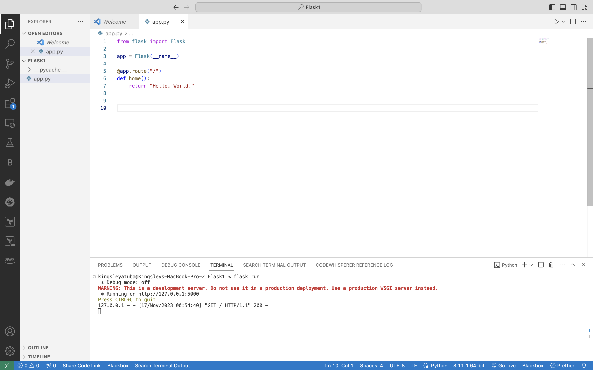

## Step 2

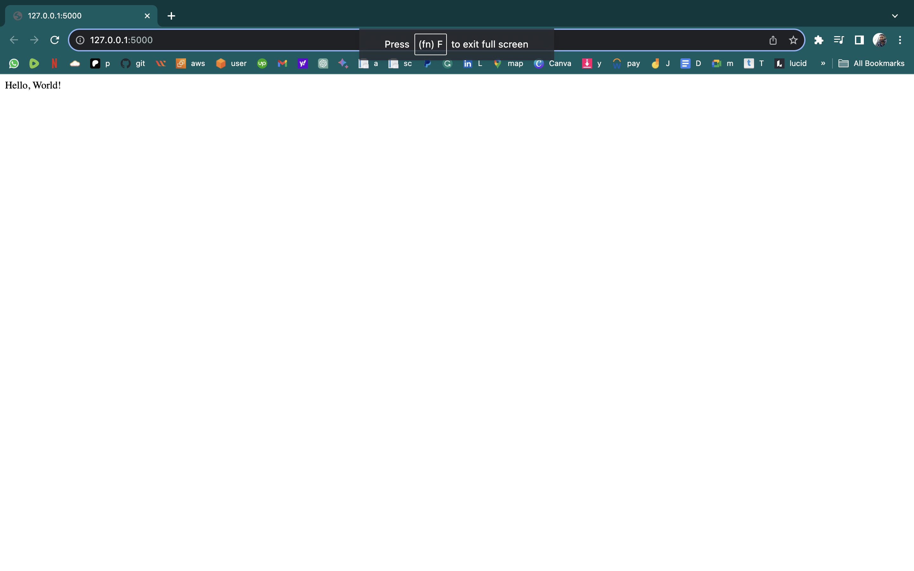

## Step 3

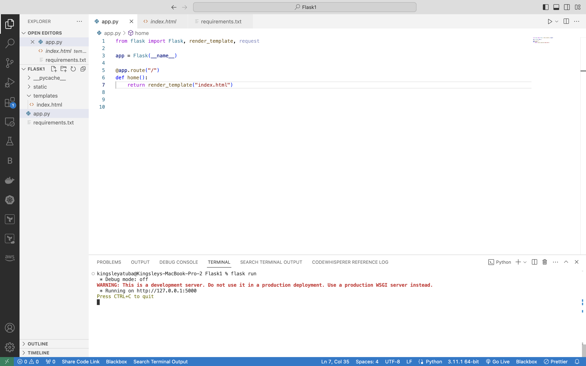

## Step 4

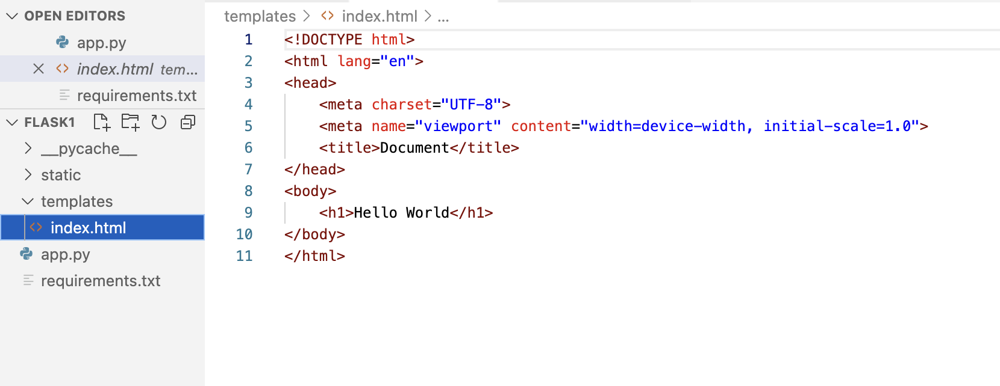

## Step 5


## Step 6

Create a form

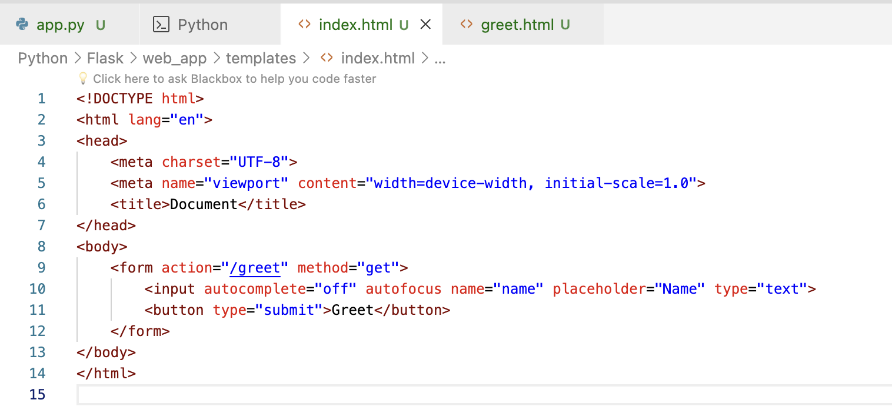

## Step 7

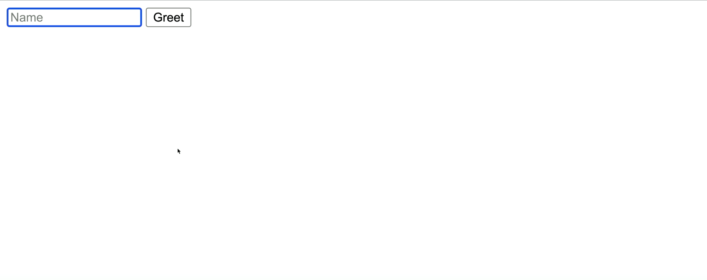

## Step 8

Create greet.html in template directory

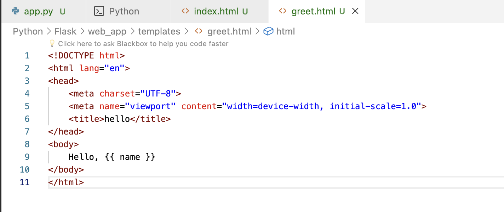

## Step 9

Update app.py

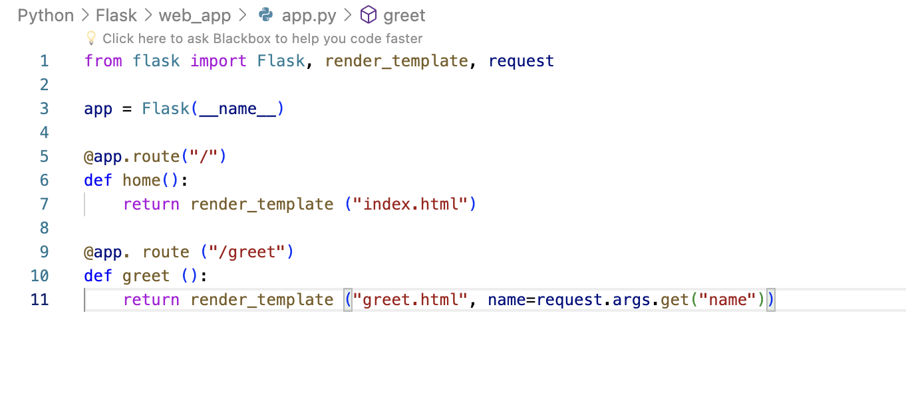

## Step 10

Run the application using `flask run` and visit the provided url

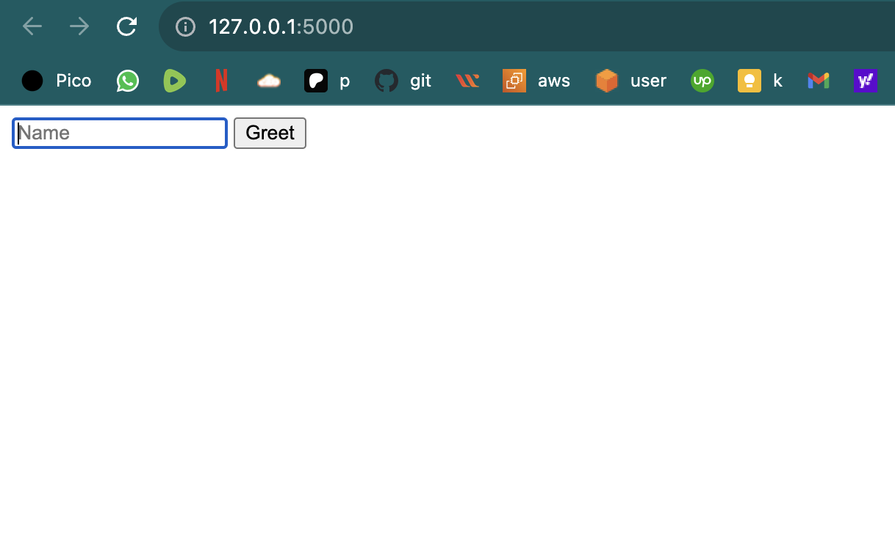

## Step 11

Type in a name

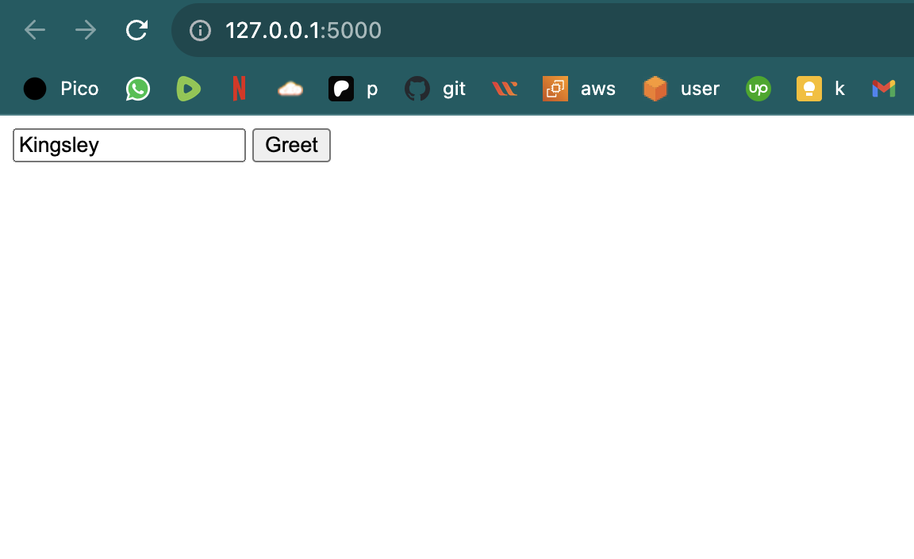

==

## Step 12

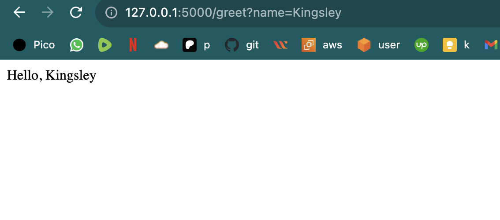

## Step 13

Introducing Jinja Template

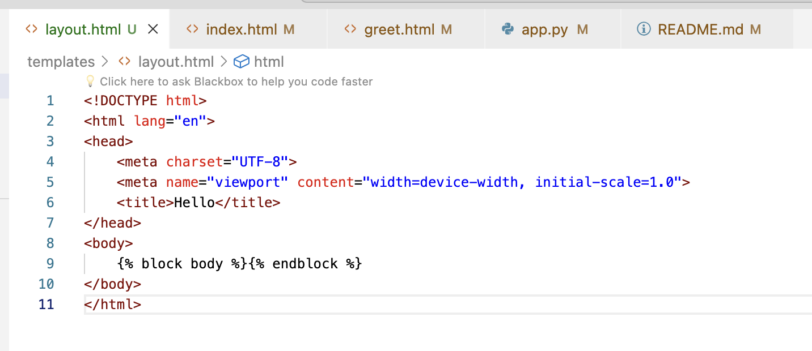

## Step 14

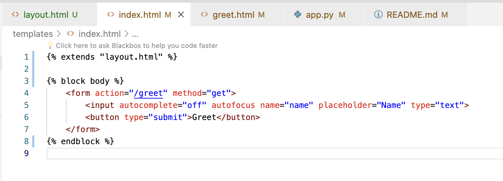

## Step 15

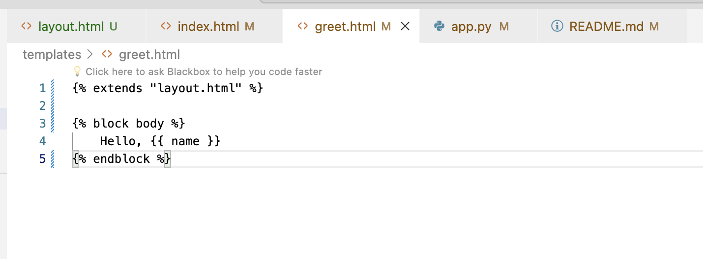

## Step 16

Repeat step 10, 11 and 12 again to confirm that Jinja works

# Authentication and Database Connection

## Step 17

> Familiarize with Postgresql

* `https://www.youtube.com/watch?v=wTqosS71Dc4` - install postgresql on Mac video
* `https://postgresapp.com/downloads.html` - download website
* `https://www.youtube.com/watch?v=2rqMRkVvXcw` - install pgadmin on Mac
* `https://www.postgresql.org/ftp/pgadmin/pgadmin4/v7.8/macos/` - download website
* `https://www.youtube.com/watch?v=WFT5MaZN6g4` - pgAdmin Tutorial - How to Use pgAdmin
* `https://www.youtube.com/watch?v=0n41UTkOBb0&t` - install postgresql on windows video

## Step 18

run `code login.html register.html` and paste these code

* login.html
```



    <form action="/login" method="post">
        <input name="username" placeholder="Username" type="text" required>
        <input name="password" placeholder="Password" type="password" required>
        <button type="submit">Login</button>
    </form>
    <p>New user? <a href="/register">Register here</a>.</p>

```
and

* register.html
```



    <form action="/register" method="post">
        <input name="username" placeholder="Username" type="text" required>
        <input name="password" placeholder="Password" type="password" required>
        <button type="submit">Register</button>
    </form>
    <p>Already have an account? <a href="/login">Login here</a>.</p>

```

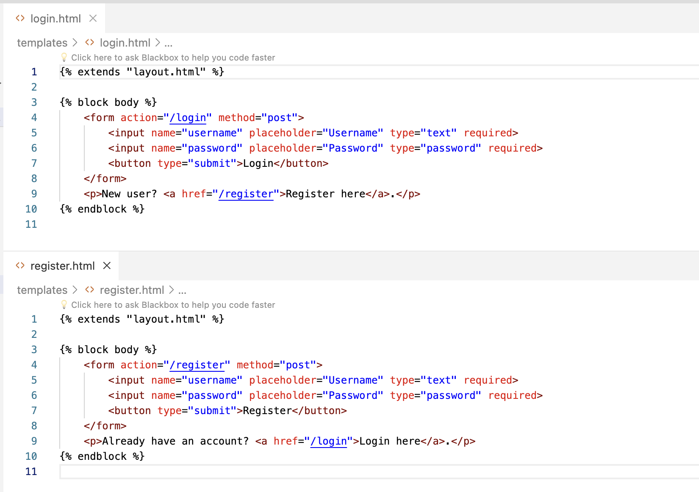


## Step 19

Create a Postgresql database in pgadmin. You can call the database Flask

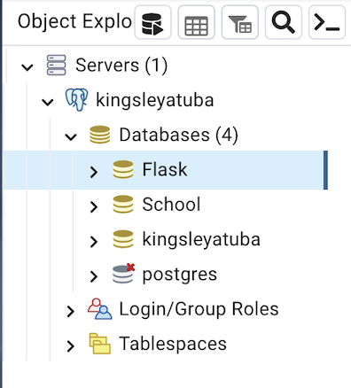

## Step 20

Run the code below to create a user table

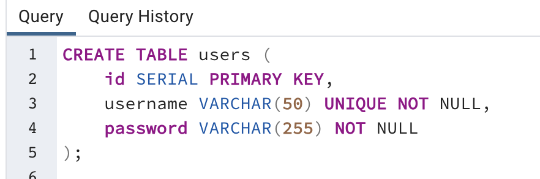

## Step 21

Run the code below to see your user table content


## Step 22

update app.py to connect to database and handle login.html and register.html


```
from flask import Flask, render_template, request, redirect, url_for, session
import psycopg2
from werkzeug.security import generate_password_hash, check_password_hash

app = Flask(__name__)
app.secret_key = 'atuba_kingsley_??_990909'

# Database connection parameters
conn_params = {
    'dbname': 'Flask',
    'user': 'kingsleyatuba',
    'password': '',
    'host': 'localhost'
}

def get_db_connection():
    conn = psycopg2.connect(**conn_params)
    return conn

@app.route("/")
def index():
    if 'user_id' not in session:
        return redirect(url_for('login'))  # Redirect to login if the session is not set
    # Render index.html if the session is established
    return render_template("index.html")

@app.route("/login", methods=["GET", "POST"])
def login():
    if request.method == "POST":
        username = request.form.get("username")
        password = request.form.get("password")

        conn = get_db_connection()
        cur = conn.cursor()
        cur.execute("SELECT * FROM users WHERE username = %s", (username,))
        user = cur.fetchone()
        print("User found:", user)  # Debug print
        cur.close()
        conn.close()

        if user and check_password_hash(user[2], password):
            session['user_id'] = user[0]  # Store the user's id in the session
            print("Password match!")  # Debug print
            return redirect(url_for('index'))
        else:
            print("Password mismatch!")  # Debug print
            return "Invalid username or password"

    return render_template("login.html")


@app.route("/register", methods=["GET", "POST"])
def register():
    if request.method == "POST":
        username = request.form["username"]
        password = request.form["password"]
        hashed_password = generate_password_hash(password)

        # Connect to the database
        conn = get_db_connection()
        cur = conn.cursor()

        # Insert the new user into the database
        cur.execute("INSERT INTO users (username, password) VALUES (%s, %s)", (username, hashed_password))
        conn.commit()

        # Close the database connection
        cur.close()
        conn.close()

        # Redirect to the login page after successful registration
        return redirect(url_for("login"))

    # If it's a GET request or the form submission was not valid
    return render_template("register.html")


@app.route("/greet", methods=["POST"])
def greet():
    name = request.form.get("name")
    return render_template("greet.html", name=name)


@app.route("/logout")
def logout():
    session.pop('user_id', None)  # Remove the user_id from the session
    return redirect(url_for('login'))


if __name__ == "__main__":
    app.run(debug=True)

```

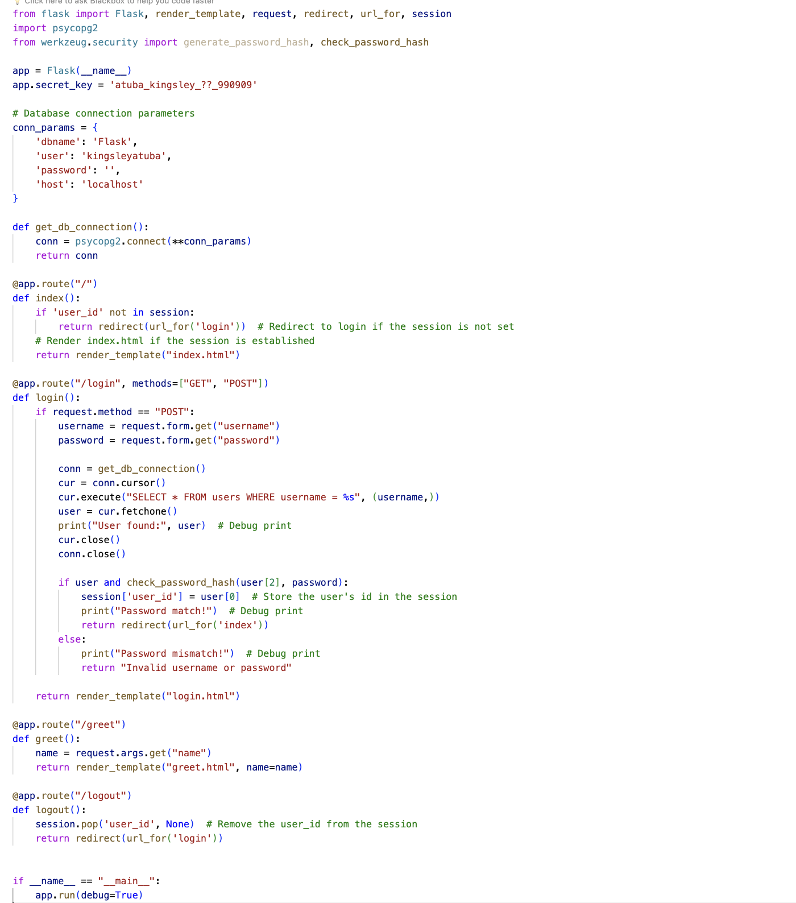


# Application modularization (or breaking app.py into seperate files)

## Step 23

run `code routes.py database.py` and paste these code

* routes.py
```
from flask import session, redirect, url_for, render_template, request
from werkzeug.security import check_password_hash, generate_password_hash
from database import get_db_connection


def index():
    if 'user_id' not in session:
        return redirect(url_for('login'))  # Redirect to login if the session is not set
    # Render index.html if the session is established
    return render_template("index.html")

def login():
    if request.method == "POST":
        username = request.form.get("username")
        password = request.form.get("password")

        conn = get_db_connection()
        cur = conn.cursor()
        cur.execute("SELECT * FROM users WHERE username = %s", (username,))
        user = cur.fetchone()
        print("User found:", user)  # Debug print
        cur.close()
        conn.close()

        if user and check_password_hash(user[2], password):
            session['user_id'] = user[0]  # Store the user's id in the session
            print("Password match!")  # Debug print
            return redirect(url_for('index'))
        else:
            print("Password mismatch!")  # Debug print
            return "Invalid username or password"

    return render_template("login.html")

def register():
    if request.method == "POST":
        username = request.form["username"]
        password = request.form["password"]
        hashed_password = generate_password_hash(password)

        # Connect to the database
        conn = get_db_connection()
        cur = conn.cursor()

        # Insert the new user into the database
        cur.execute("INSERT INTO users (username, password) VALUES (%s, %s)", (username, hashed_password))
        conn.commit()

        # Close the database connection
        cur.close()
        conn.close()

        # Redirect to the login page after successful registration
        return redirect(url_for("login"))

    # If it's a GET request or the form submission was not valid
    return render_template("register.html")

def greet():
    name = request.form.get("name")
    return render_template("greet.html", name=name)

def logout():
    session.pop('user_id', None)  # Remove the user_id from the session
    return redirect(url_for('login'))
```

and

* database.py
```
import psycopg2

conn_params = {
    'dbname': 'Flask',
    'user': '<your-database-user-name>',
    'password': '',
    'host': 'localhost'
}

def get_db_connection():
    return psycopg2.connect(**conn_params)

```

* app.py
```
from flask import Flask
from routes import index, login, register, greet, logout


app = Flask(__name__)
app.secret_key = 'atuba_kingsley_??_990909'

app.add_url_rule("/", "index", index)
app.add_url_rule("/login", "login", login, methods=["GET", "POST"])
app.add_url_rule("/register", "register", register, methods=["GET", "POST"])
app.add_url_rule("/greet", "greet", greet, methods=["POST"])
app.add_url_rule("/logout", "logout", logout)

if __name__ == "__main__":
    app.run(debug=True)
```


## Step 24

add the code below to both index.html and greet.html

```
<p><a href="{{ url_for('logout') }}">Logout</a></p>
```

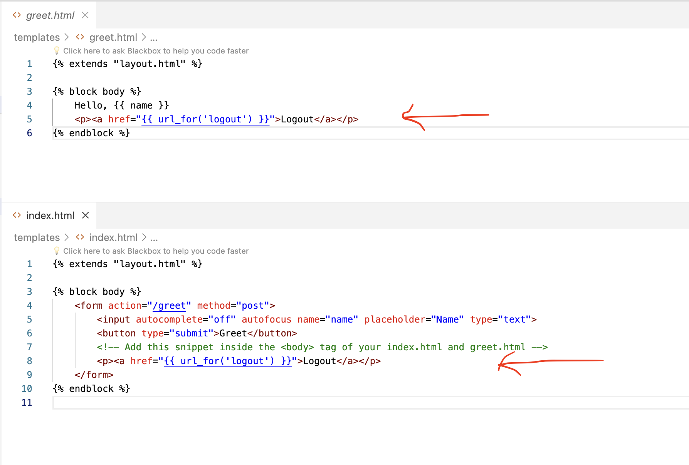